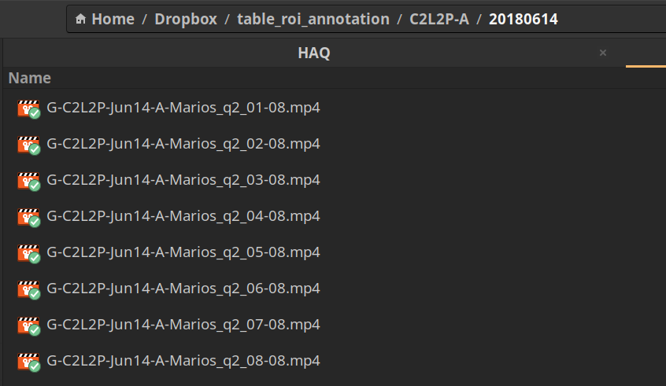

# Table ROI labeling

This document outlines the table ROI labeling procedure. The labeling
procedure is designed to be fast, sparse and an outline. For this
tutorial we will be using the group videos form [C2L2-A on
20180614](https://aolme.unm.edu/Videos/cur_group_videos.php?cohort=2&school=Polk&level=2&group=A&date=2018-06-14).

## Dowload videos

Download/Copy all the group interaction vidoes to a directory.

