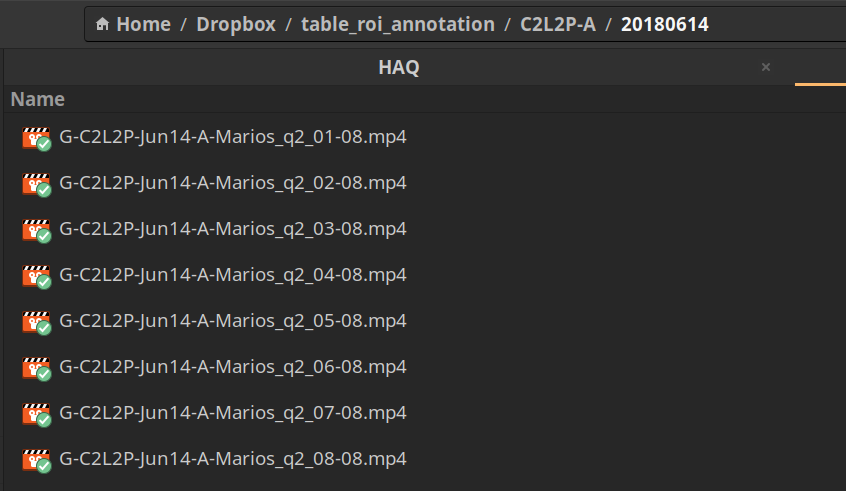

# Table ROI labeling

This document outlines the table ROI labeling procedure. The labeling
procedure is designed to be fast, sparse and an outline. For this
tutorial we will be using the group videos form [C2L2-A on
20180614](https://aolme.unm.edu/Videos/cur_group_videos.php?cohort=2&school=Polk&level=2&group=A&date=2018-06-14).

Please change the paths as necessary.

## 1. Dowload videos

Download/Copy all the group interaction vidoes to a directory.



## 2. Standardize frame rate to 30 fps

If the downloaded videos are already at 30fps add *"_30fps"* at the
end of its name. You can check the frame rate using VLC media player, `Tools -> Media information -> Codec`.


Otherwise, please use `ffmpeg` to change the frame rate.
The command is,

```shell
ffmpeg -i <input.mp4> -r 30 -c:v copy -c:a copy <output.mp4>
```

## 2. Create a session video

We first combined all the videos in a session taking one frame every
second. We call this file, `session_video.mp4`. A video that has $`t`$
seconds will contribute $`t+1`$ frames.

The script that does this is, `create_session_videos.py`. Located at
`HAQ/table-roi`.

To use this script you have to instlal `pytkit`. This is available in the
`shared_tool_kits` (shared with Hannah and Miguel).

```shell
# Change directory to the python scrip
cd /home/vj/Dropbox/Marios_Shared/HAQ-AOLME/software/HAQ/table-roi

# Create a session video that is 1 fps
python create_session_videos.py /home/vj/Dropbox/table_roi_annotation/C2L2P-A/20180614 all
```

## 3. Label the session video

1. Create Labels using pseudonyms
2. Select automation algorithm, "temporal interpolator"
3. Find interval where there is no
  - Camera change
  - Seating change
4. Hit  "Automate"
    4.1 Lable the bounding box sparsely across the time interval.
    4.2 Press the "Run" button.
    4.3 Press the "Accept" button.
    4.4 Repeat steps 4.1 through 4.3 for other students and facilitator
5. Repeat steps 3 to 4 for rest of the video intervals.

[Demo YouTube link](https://youtu.be/U81c37z-dKo)